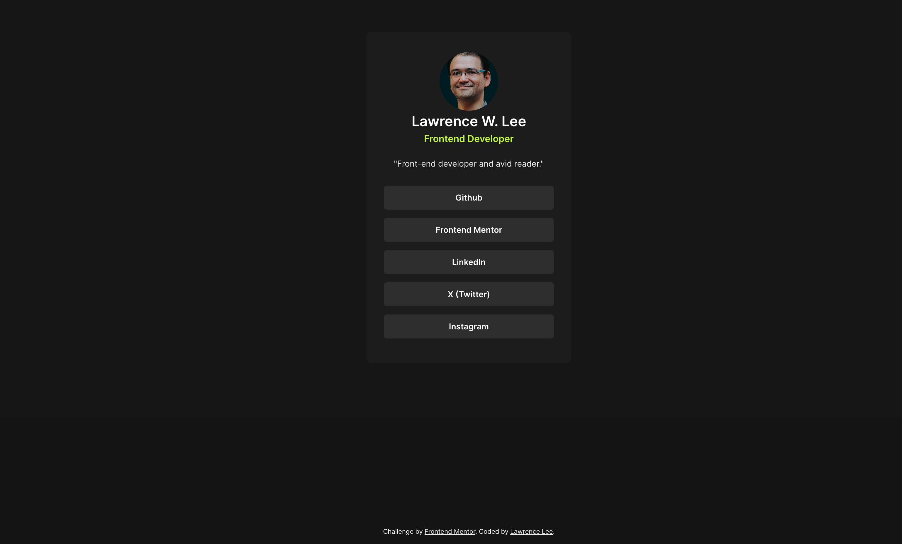
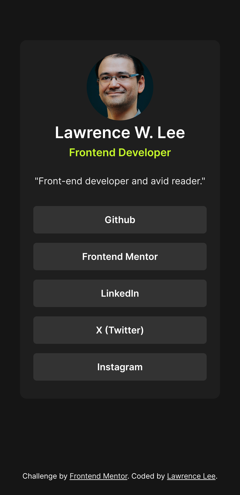

# Frontend Mentor - Social links profile solution

This is a solution to the [Social links profile challenge on Frontend Mentor](https://www.frontendmentor.io/challenges/social-links-profile-UG32l9m6dQ). Frontend Mentor challenges help you improve your coding skills by building realistic projects.

## Table of contents

- [Overview](#overview)
  - [The challenge](#the-challenge)
  - [Screenshot](#screenshot)
  - [Links](#links)
- [My process](#my-process)
  - [Built with](#built-with)
  - [What I learned](#what-i-learned)
  - [Continued development](#continued-development)
  - [Useful resources](#useful-resources)
- [Author](#author)

**Note: Delete this note and update the table of contents based on what sections you keep.**

## Overview

### The challenge

Users should be able to:

- See hover and focus states for all interactive elements on the page

### Screenshot

Desktop

Mobile

### Links

- Solution URL: [Github Page](https://github.com/LawrenceLCodes/social-links-profile-card)
- Live Site URL: [Live Site](https://your-live-site-url.com)

## My process

### Built with

- Semantic HTML5 markup
- CSS hover, focus states
- Flexbox

### What I learned

This challenge was similiar to the previous blog preview card however, I did run into a small issue where the clickable a tag was smaller than the full button area as per the design.

### Continued development

No immediate plans for additional features or functionality; however I am open to feedback or suggestions for improvement.

### Useful resources

- [Clickable Area Resource](https://ishadeed.com/article/clickable-area/) - This is the site I found which helped me increase the clickable area of the social media a tags. I have saved this link and will be adding this to my personal repository for buttons and clickable links.

## Author

- Website - [Lawrence W. Lee](https://www.lawrencelcodes.dev/)
- Frontend Mentor - [@LawrenceLCodes](https://www.frontendmentor.io/profile/LawrenceLCodes)
- Twitter - [@LawrenceLCodes](https://x.com/LawrenceLCodes)
